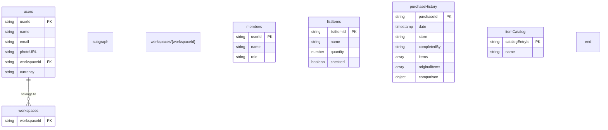

# Joaquin - App Architecture & Core Concepts

This document provides a detailed overview of the core architectural concepts, data structures, and logic flow for the Joaquin application. It is intended as a technical reference for developers.

## Core Concepts

The application is designed around a continuous, collaborative shopping experience for a group of users (e.g., a family, roommates) within a **Workspace**.

### 1. The Workspace

The entire application operates within the context of a shared workspace. All data, including lists, history, and items, is scoped to the user's workspace. This ensures that a group has its own private, collaborative environment.

### 2. The List Lifecycle

Instead of creating separate, disposable lists, the app uses a continuous lifecycle model with a single **"Active List"**. This process is designed to mirror the natural, recurring rhythm of household shopping.

```mermaid
flowchart TD
    A[Active List] -->|User clicks "Finish Shopping"| B{Archiving Process};
    B --> C{New Purchase Record Created};
    subgraph History
        C;
    end
    C -->|Optional| D(User analyzes receipt with AI);
    D --> E{Comparison data is added<br/>(forgotten items, impulse buys)};
    C --> F[New Active List];
    E --> F;
    subgraph New List
        F;
    end
    A --- F;
```

1.  **Active List:** There is always one, and only one, active grocery list for the workspace. All users in the workspace can view and add items to this list in real-time. This is the primary focus of the `/list` page.
2.  **Completing a List:** When a user has finished a shopping trip, any user can "complete" the current active list by clicking the "Finish Shopping" button. This action triggers the archiving process. We log which user completed the list for accountability.
3.  **Archiving to History:** The list of *checked* items is saved as a new, immutable purchase record in the **Purchase History**. This history is viewable on the `/history` page.
4.  **AI Analysis (Optional):** From the history page, a user can upload a photo of the receipt for that purchase. This triggers a Genkit AI flow that extracts the store name, item prices, and, crucially, compares the receipt to the original list to identify **forgotten items** and **impulse buys**. This `comparison` data is then saved back to the purchase record.
5.  **Rebirth of the Active List:** The checked items are removed from the active list. Any items that were **left unchecked** on the previous list are **automatically carried over**, ensuring they are not forgotten on the next trip.

### 3. The Item Catalog

To ensure data consistency (e.g., avoiding duplicates like "Milk" and "milk"), each workspace has its own **Item Catalog**.

*   **Default Catalog:** Workspaces start with a pre-populated list of common grocery items to provide initial search suggestions.
*   **Automatic Growth:** When a user adds an item to the list that doesn't exist in the catalog, it is automatically added to the workspace's shared catalog. This makes it easily searchable for all members in the future.

### 4. The Analytics Engine

The `/analytics` page provides a dashboard visualizing the shopping data. It's important to understand the data dependencies for each insight:

*   **Spending Rhythm & Price Watch:** These charts rely on purchases where items have a `price` greater than zero. Prices are added during the AI Receipt Analysis step.
*   **Top Shoppers:** This is calculated based on the `completedBy` field on all purchase records.
*   **Forgotten & Impulse Buys:** These insights are only available for purchases that have undergone AI receipt analysis and have a populated `comparison` object in their data.

## Data & Persistence (Firestore Schema)

The application uses **Cloud Firestore** for data persistence and real-time synchronization. The schema is designed to be scalable, secure, and efficient. It revolves around two primary top-level collections: `users` and `workspaces`.



### Collection Breakdown:

*   **/users/{userId}**:
    *   This collection stores individual user profiles.
    *   The document ID (`userId`) corresponds to the user's Firebase Authentication UID.
    *   The `workspaceId` field is a critical link that associates a user with their shared workspace. When a user logs in, the app first fetches their user document to find this ID, and then retrieves the corresponding workspace data.

*   **/workspaces/{workspaceId}**:
    *   This is the central container for all shared data for a specific group (e.g., a family). All data is scoped under a workspace to ensure privacy and efficient querying.
    *   It contains several important sub-collections:
        *   **`members`**: Stores a record for each user who has access to the workspace. This is useful for listing members and for writing security rules (e.g., "only members can read list data").
        *   **`listItems`**: Holds the documents for the **current, active grocery list**. Storing each item as a separate document is crucial for real-time collaboration and avoids hitting document size limits.
        *   **`purchaseHistory`**: Contains records of all completed shopping trips. Each document represents one archived list and includes the `comparison` object if a receipt has been analyzed.
        *   **`itemCatalog`**: Stores all unique item names for that workspace, which powers the search suggestions. Each item is its own document to ensure the catalog can scale indefinitely and to make adding/deleting items efficient.

## Project Structure

The project follows the standard Next.js App Router structure.

```
/src
├── ai/
│   ├── flows/
│   │   └── analyze-receipt.ts  # Genkit flow for receipt OCR and comparison
│   └── genkit.ts               # Genkit initialization
├── app/
│   ├── (app)/                  # Main application route group
│   │   ├── analytics/page.tsx  # Analytics dashboard page
│   │   ├── history/page.tsx    # Purchase history page
│   │   ├── layout.tsx          # Layout for the main app (sidebar/nav)
│   │   ├── list/page.tsx       # "Active" grocery list page
│   │   └── settings/page.tsx   # Settings page (for profile & acct mgmt)
│   ├── globals.css             # Global styles and CSS variables for theming
│   ├── layout.tsx              # Root layout
│   └── page.tsx                # Root page (redirects to /list)
├── components/
│   ├── ui/                     # shadcn/ui components
│   ├── analytics-dashboard.tsx # Component rendering all analytics charts
│   ├── grocery-list-client.tsx # Client component managing list state
│   ├── icons.tsx               # Custom SVG icons (e.g., Logo)
│   └── receipt-analyzer.tsx    # Dialog and logic for the AI receipt scanner
├── contexts/
│   └── auth-context.tsx        # Manages user authentication state
├── hooks/
│   ├── use-currency.tsx        # Hook for managing and formatting currency
│   └── use-toast.ts            # Hook for showing toast notifications
└── lib/
    ├── firebase.ts             # Firebase app initialization
    ├── firestore.ts            # All Firestore query and mutation logic
    ├── types.ts                # Core TypeScript type definitions
    └── utils.ts                # Utility functions (e.g., cn for classnames)
```

### AI Functionality (`src/ai`)

The application's AI capabilities are powered by **Genkit**. The core flow is `analyzeReceipt`, defined in `src/ai/flows/analyze-receipt.ts`.

-   **Input:** A base64-encoded data URI of a receipt image and a JSON array of the original items that were on the shopping list.
-   **Process:** The Genkit flow sends the image and JSON to a Google AI model. The prompt instructs the model to act as a receipt analyzer and to explicitly compare the items on the receipt to the original list.
-   **Output:** A structured JSON object containing the store name, an array of items (with name, quantity, and price), and a `comparison` object containing two arrays: `forgottenItems` and `impulseBuys`. This JSON can then be used to update a purchase history record.
